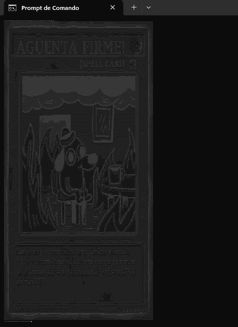

# Image to ASCII

Converts an image to an ASCII characters.

- The class ImageToAscii gives to you many methods to use.

- The class Main gives you a use example and I added a method for you to run the Main in the terminal.
## Screenshots

